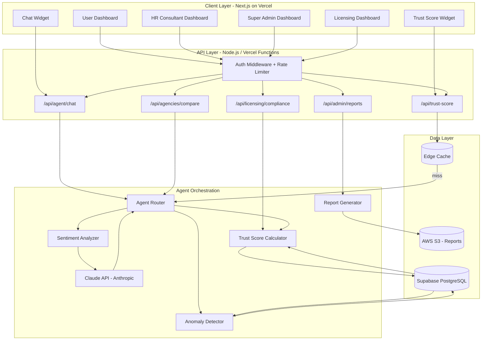

# Agentic JSO — Assignment Submission
## Agency Trust & Transparency Agent

**Candidate:** Reeth J  
**Role:** Agentic AI Engineer Intern (Career Intelligence Systems)  
**Company:** AariyaTech Corp Private Limited  
**Date:** March 2026

---

# Part A: Core Questions

---

## Section 1 — Why Agentic JSO

### 1. Why does the JSO platform require AI Agents in Phase-2?

JSO Phase-1 established the foundational infrastructure — dashboards for users, HR consultants, super admins, and licensing management. However, Phase-1 relies heavily on **manual human decision-making** at every step: HR consultants manually review candidates, users manually browse agencies, and admins manually monitor compliance.

Phase-2 requires AI agents because:

- **Scale demands automation:** As JSO grows globally, the volume of job seekers, agencies, and consultants will outpace human capacity. AI agents can process thousands of data points simultaneously — evaluating agency reputation, matching candidates to roles, and flagging compliance issues — without bottlenecks.

- **Real-time intelligence:** Users expect instant, personalized insights. An AI agent can analyze agency trust scores, predict placement success, and surface relevant opportunities in real time, rather than requiring users to manually sift through listings.

- **Consistency and fairness:** Human decision-making introduces bias (conscious or unconscious). AI agents, when designed with proper governance guardrails, apply consistent evaluation criteria across all agencies, consultants, and job seekers — aligning with JSO's mission of solving the global job search problem fairly.

- **Proactive engagement:** Phase-1 is reactive (users search, consultants respond). AI agents enable a **proactive model** — alerting users about newly trustworthy agencies, notifying HR consultants of emerging talent pools, and flagging risks to admins before they escalate.

### 2. What inefficiencies exist in the current Phase-1 system?

Based on the typical architecture of a multi-dashboard career platform like JSO, the following inefficiencies likely exist:

- **Manual agency vetting:** Users have no automated way to assess agency trustworthiness. They must rely on word-of-mouth or superficial profile information, leading to poor choices and potential exploitation by unverified agencies.

- **Delayed feedback loops:** When a user has a bad experience with an agency, the feedback cycle is slow — manual reviews, delayed admin action. Problematic agencies can continue operating for weeks before issues are addressed.

- **HR consultant workload imbalance:** Without intelligent routing, some consultants may be overloaded while others are underutilized. There is no AI-driven workload distribution.

- **Static dashboards:** Current dashboards likely display raw data without intelligent summarization. Admins must manually analyze trends in agency performance, user satisfaction, and placement rates.

- **No predictive capability:** Phase-1 lacks predictive analytics — it cannot forecast which agencies are trending downward in quality, which job sectors are emerging, or which users are at risk of dropout.

- **Fragmented data:** User reviews, placement data, and agency information likely sit in separate tables/services without a unified intelligence layer connecting them.

### 3. How can AI agents improve user experience and platform efficiency?

| Improvement Area | How AI Agents Help |
|---|---|
| **Agency Discovery** | Trust scoring agent ranks agencies by composite reputation metrics (reviews, success rates, feedback), eliminating guesswork for users |
| **Personalization** | Agents learn user preferences and career goals to recommend the most relevant and trustworthy agencies for their specific needs |
| **Speed** | Automated analysis replaces manual research — users get instant trust insights instead of spending hours reading reviews |
| **Quality Control** | Agents continuously monitor agency performance and automatically flag declining agencies to admins |
| **Consultant Productivity** | AI handles routine assessments, freeing HR consultants to focus on high-value relationship building |
| **Data-Driven Decisions** | Real-time analytics dashboards powered by agents give admins actionable intelligence instead of raw data |
| **Fraud Prevention** | Pattern recognition agents can detect fake reviews, suspicious placement claims, and compliance violations early |

---

## Section 2 — Agent Design

### 1. What type of AI agent should be built?

An **Agency Trust & Transparency Agent** — a multi-modal evaluation agent that operates as an autonomous analytical system with the following characteristics:

- **Type:** Reactive + Proactive hybrid agent
  - **Reactive:** Responds to user queries ("Is Agency X trustworthy?", "Compare these agencies")
  - **Proactive:** Continuously monitors agency data and triggers alerts when trust scores change significantly

- **Architecture pattern:** Tool-using LLM agent with structured data access
  - Uses Claude API (Anthropic) as the reasoning backbone
  - Has tool access to Supabase database for reviews, placement records, and feedback data
  - Employs a scoring pipeline that combines quantitative metrics with sentiment analysis

- **Interaction model:** Conversational + Dashboard-integrated
  - Users can ask natural language questions about agencies
  - Results also surface as trust score widgets embedded in dashboards

### 2. What tasks will this agent automate?

1. **Trust Score Computation:** Aggregate reviews, placement success rates, and feedback ratings into a composite 0–100 trust score using weighted multi-factor analysis
2. **Sentiment Analysis:** Analyze free-text reviews to extract sentiment, identify recurring themes (positive and negative), and detect fake/spam reviews
3. **Trend Detection:** Monitor trust score trajectories over time — flag agencies with declining scores to admins
4. **Comparative Analysis:** Allow users to compare multiple agencies side-by-side with AI-generated summaries
5. **Anomaly Detection:** Identify unusual patterns (sudden review spikes, placement rate drops) that may indicate gaming or fraud
6. **Report Generation:** Auto-generate trust reports for the Super Admin and Licensing dashboards
7. **Recommendation Engine:** Suggest top-trusted agencies to users based on their industry, location, and career level

### 3. How will the agent interact with the existing dashboard?

The agent integrates at three levels:

**Embedded Widgets:**
- Trust score badges displayed on agency cards across all dashboards
- Real-time trust trend sparklines on agency profiles
- "AI Verified" indicators for agencies meeting trust thresholds

**Conversational Interface:**
- A chat panel (bottom-right of dashboard) where users can ask questions like:
  - "Which IT agencies in Bangalore have the highest trust scores?"
  - "Why did Agency X's score drop last month?"
  - "Compare Agency A vs Agency B"

**Notification Layer:**
- Push notifications to admins when an agency's trust score crosses a threshold
- Weekly digest emails to HR consultants highlighting trust score changes in their agency network
- Alert banners on user dashboard if they're engaging with a low-trust agency

---

## Section 3 — Problem Solving

### 1. What specific problem does this agent solve?

**The Agency Trust Gap Problem.**

In the current JSO ecosystem, users (job seekers) face a critical information asymmetry: they cannot reliably assess which recruitment agencies are trustworthy before engaging with them. This leads to:

- Job seekers wasting time with low-quality or fraudulent agencies
- Legitimate agencies losing business because they can't differentiate themselves from bad actors
- HR consultants being associated with poorly-rated agencies, damaging their professional reputation
- The JSO platform's overall credibility being undermined by the presence of unvetted agencies

The Agency Trust & Transparency Agent solves this by creating an **automated, transparent, data-driven trust evaluation system** that continuously scores agencies based on objective metrics — making trust visible, verifiable, and actionable.

### 2. Provide a real scenario showing how the agent improves the platform.

**Scenario: Priya, a software engineer in Mumbai, is looking for legitimate overseas placement agencies.**

**Without the agent (Phase-1):**
1. Priya browses the JSO agency listings — she sees 50+ agencies with similar descriptions
2. She reads a few reviews but can't tell if they're genuine
3. She contacts 3 agencies, spends 2 weeks in their process
4. Two agencies ghost her after collecting documents; one was a scam
5. Priya loses trust in the JSO platform entirely

**With the Agency Trust & Transparency Agent (Phase-2):**
1. Priya opens the JSO dashboard and sees agencies ranked by **Trust Score** (76/100, 92/100, etc.)
2. She asks the agent: *"Which agencies have the best placement success for IT roles in Europe?"*
3. The agent responds with a ranked list showing:
   - **TechPlace Global** — Trust Score: 94 | Placement Rate: 78% | 342 verified reviews | Trend: ↑ Improving
   - **CareerBridge Int.** — Trust Score: 87 | Placement Rate: 65% | 198 verified reviews | Trend: → Stable
4. She clicks on TechPlace Global and sees the AI-generated trust summary: *"Consistently high placement rates in EU IT sector. 96% of reviews verified genuine. Average time-to-placement: 45 days. No compliance flags."*
5. Priya engages with TechPlace Global confidently and gets placed within 6 weeks
6. Her positive experience feeds back into the trust scoring system, benefiting future users

**Impact:** Reduced user drop-off, prevented fraud exposure, increased platform credibility, and created a positive feedback loop for quality agencies.

---

## Section 4 — Dashboard Integration

### A. User Dashboard

**Integration:** Trust Score Widget + Conversational Agent

**Example:** When a user views agency listings, each agency card displays a prominent trust score badge (e.g., "Trust: 92/100 ✓"). Clicking it opens a detailed breakdown panel showing the score components (reviews: 4.5/5, placement rate: 78%, feedback: 4.2/5, tenure: 3 years on platform). The user can also chat with the agent: "Show me the most trusted agencies for healthcare jobs in Canada."

### B. HR Consultant Dashboard

**Integration:** Agency Performance Monitor + Alert System

**Example:** An HR consultant manages relationships with 15 agencies. The agent provides a "My Agency Network" panel showing real-time trust score changes. When an agency's score drops below 60, the consultant receives an alert: "Agency XYZ trust score dropped from 72 to 58 this week due to 12 negative placement reviews. Recommended action: schedule a performance review call." This helps consultants proactively manage their network quality.

### C. Super Admin Dashboard

**Integration:** Platform-Wide Trust Analytics + Anomaly Alerts

**Example:** The admin dashboard shows an "Agency Trust Overview" section with: distribution of trust scores across all agencies (histogram), agencies flagged for review (score < 50 or sudden drops), fake review detection alerts, and monthly trust trend reports. The admin can ask: "Show me all agencies with declining trust scores over the last 3 months" and get an AI-generated report with recommended actions (warn, suspend, or remove agencies).

### D. Licensing Dashboard

**Integration:** Compliance-Linked Trust Verification

**Example:** When an agency applies for license renewal, the agent automatically generates a "Trust Compliance Report" that includes: current trust score, placement success rate, review authenticity index, and any flagged violations. If the trust score is below the licensing threshold (e.g., 50/100), the system automatically flags the renewal for manual review and generates a report: "Agency ABC does not meet minimum trust requirements for license renewal. Key concerns: 23% placement rate (minimum: 40%), 8 unresolved complaints." This ensures only quality agencies maintain active licenses.

---

## Section 5 — Technical Architecture

### Architecture Overview

```
┌─────────────────────────────────────────────────────────────────┐
│                        CLIENT LAYER                             │
│  Next.js + React Frontend (Vercel)                              │
│  ┌──────────┐ ┌──────────────┐ ┌────────────┐ ┌──────────────┐│
│  │User Dash │ │HR Consultant │ │Super Admin │ │  Licensing   ││
│  │Dashboard │ │  Dashboard   │ │ Dashboard  │ │  Dashboard   ││
│  └────┬─────┘ └──────┬───────┘ └─────┬──────┘ └──────┬───────┘│
│       └───────────────┴───────────────┴───────────────┘        │
│                           │                                     │
│                    Trust Score Widgets                           │
│                    Chat Interface                                │
│                    Notification Panel                            │
└───────────────────────────┬─────────────────────────────────────┘
                            │ HTTPS / WebSocket
                            ▼
┌─────────────────────────────────────────────────────────────────┐
│                       API LAYER (Node.js)                       │
│  ┌────────────────┐ ┌──────────────┐ ┌────────────────────────┐│
│  │ /api/trust-     │ │/api/agent/   │ │ /api/admin/            ││
│  │   score         │ │  chat        │ │   trust-reports        ││
│  │ /api/agencies/  │ │/api/agent/   │ │ /api/licensing/        ││
│  │   compare       │ │  analyze     │ │   compliance-check     ││
│  └────────┬───────┘ └──────┬───────┘ └──────────┬─────────────┘│
│           └────────────────┴────────────────────┘              │
└───────────────────────────┬─────────────────────────────────────┘
                            │
                            ▼
┌─────────────────────────────────────────────────────────────────┐
│                    AGENT ORCHESTRATION LAYER                    │
│                                                                 │
│  ┌──────────────────┐  ┌───────────────────┐  ┌──────────────┐ │
│  │  Trust Score      │  │  Sentiment        │  │  Anomaly     │ │
│  │  Calculator       │  │  Analyzer         │  │  Detector    │ │
│  │  (Weighted algo)  │  │  (Claude API)     │  │  (Stats)     │ │
│  └────────┬─────────┘  └────────┬──────────┘  └──────┬───────┘ │
│           │                     │                     │         │
│  ┌────────▼─────────────────────▼─────────────────────▼───────┐ │
│  │              Agent Router (Claude / Anthropic)              │ │
│  │         Reasoning, tool-use, response generation            │ │
│  └────────────────────────────┬────────────────────────────────┘ │
└───────────────────────────────┬─────────────────────────────────┘
                                │
                                ▼
┌─────────────────────────────────────────────────────────────────┐
│                        DATA LAYER                               │
│                                                                 │
│  ┌────────────────┐  ┌──────────────┐  ┌──────────────────────┐│
│  │   Supabase     │  │   AWS S3     │  │  Google Cloud        ││
│  │   PostgreSQL   │  │  (Documents, │  │  (Backup, CDN,       ││
│  │                │  │   Reports)   │  │   Analytics)         ││
│  │  - agencies    │  │              │  │                      ││
│  │  - reviews     │  │              │  │                      ││
│  │  - placements  │  │              │  │                      ││
│  │  - trust_scores│  │              │  │                      ││
│  │  - feedback    │  │              │  │                      ││
│  └────────────────┘  └──────────────┘  └──────────────────────┘│
└─────────────────────────────────────────────────────────────────┘
```

### AI Infrastructure Choice: Anthropic Claude

**Primary LLM:** Claude (Opus 4.6) via Anthropic API

**Why Claude:**
- Superior reasoning for multi-factor analysis tasks
- Strong instruction-following for structured trust evaluations
- Built-in safety and ethical alignment — critical for a platform affecting people's livelihoods
- Tool-use capability for structured data retrieval from Supabase
- Cost-efficient for the evaluation workload profile

**Supporting Services:**
- **Supabase Edge Functions:** For real-time trust score updates and webhook triggers
- **AWS S3:** Document storage for generated trust reports
- **Vercel Edge Functions:** API routing and caching layer
- **Google Cloud (BigQuery):** Long-term analytics and trend computation

### Trust Score Algorithm

```
Trust Score = (W1 × Review Score) + (W2 × Placement Rate) + (W3 × Feedback Rating) 
              + (W4 × Tenure Score) + (W5 × Compliance Score) - Penalty

Where:
  W1 = 0.30 (Review sentiment, weighted by recency)
  W2 = 0.25 (Successful placements / total placements)
  W3 = 0.20 (Average feedback rating, normalized)
  W4 = 0.10 (Years active on platform, capped at 5)
  W5 = 0.15 (Compliance record — no violations = full score)
  Penalty = Anomaly penalties (fake reviews, complaints, etc.)
```

---

## Section 6 — Integration With Phase-1

### API Integration

| API Endpoint | Method | Purpose | Trigger |
|---|---|---|---|
| `/api/trust-score/:agencyId` | GET | Fetch trust score for a specific agency | User views agency profile |
| `/api/trust-score/batch` | POST | Fetch trust scores for multiple agencies | Dashboard loads agency listings |
| `/api/agent/chat` | POST | Send user query to the trust agent | User interacts with chat widget |
| `/api/agent/analyze` | POST | Trigger deep analysis of an agency | Admin requests detailed report |
| `/api/agencies/compare` | POST | Compare multiple agencies | User selects agencies to compare |
| `/api/admin/trust-reports` | GET | Fetch platform-wide trust analytics | Admin dashboard loads |
| `/api/licensing/compliance-check/:id` | GET | Trust compliance check for licensing | License renewal triggered |
| `/api/webhooks/review-added` | POST | Webhook: recalculate score on new review | Supabase trigger on review insert |

### Event Triggers

```
Supabase Database Triggers:
├── ON INSERT → reviews table → Recalculate agency trust score
├── ON INSERT → placements table → Update placement success rate  
├── ON INSERT → feedback table → Update feedback component
├── ON UPDATE → agencies table → Revalidate compliance status
└── CRON (daily) → Batch recalculate all trust scores, detect anomalies

Vercel Edge Middleware:
├── Request authentication via Supabase Auth JWT
├── Rate limiting on agent chat endpoints
└── Response caching for trust scores (TTL: 5 minutes)
```

### Data Flow

```
User Action (e.g., views agency)
  → Next.js Frontend sends request
    → Vercel Edge Function (auth + rate limit)
      → Node.js API route checks cache
        → Cache HIT: Return cached trust score
        → Cache MISS: 
          → Query Supabase (reviews, placements, feedback)
          → Send to Agent Orchestration Layer
          → Claude API processes (sentiment + reasoning)
          → Compute trust score
          → Store in Supabase trust_scores table
          → Cache result
          → Return to frontend
```

### MCP (Model Context Protocol) / APA Security

**Model Context Protocol (MCP) Implementation:**
- All interactions between the Claude agent and data sources use structured MCP tool definitions
- Each tool has explicit permission scopes (read-only for user-facing queries, read-write for admin operations)
- Tool calls are logged with full audit trails in Supabase

**Security Protocols:**
- **Authentication:** Supabase Auth with JWT tokens; role-based access control (User, HR Consultant, Admin, Licensing)
- **Authorization:** Row-Level Security (RLS) in Supabase ensures users only access permitted data
- **Data Encryption:** TLS 1.3 in transit; AES-256 at rest (Supabase default)
- **API Security:** Rate limiting (100 req/min per user), input sanitization, CORS restrictions
- **Agent Guardrails:** Claude system prompts enforce boundaries — the agent cannot modify data, only read and analyze. Write operations require explicit admin confirmation
- **Audit Logging:** Every agent interaction logged (query, response, data accessed, timestamp, user ID) for transparency and compliance
- **PII Protection:** Reviews are anonymized before sentiment analysis; no personal data sent to Claude API beyond what's necessary for the query

---

## Section 7 — Timeline

| Phase | Duration | Activities |
|---|---|---|
| **Architecture Design** | Week 1 | Finalize system design, database schema, API contracts, Claude prompt engineering, MCP tool definitions |
| **Core Agent Development** | Week 2–3 | Trust score algorithm, sentiment analysis pipeline, anomaly detection, Claude integration, Supabase triggers |
| **Dashboard Integration** | Week 4 | Trust score widgets, chat interface, notification system, all four dashboard integrations |
| **Testing & QA** | Week 5 | Unit tests, integration tests, load testing, security audit, bias testing on trust scores |
| **Deployment & Monitoring** | Week 6 | Vercel deployment, monitoring setup, documentation, stakeholder demo, feedback iteration |

**Total Estimated Duration: 6 weeks**

---

# Part B: Main Task Execution

## Agency Trust & Transparency Agent — Detailed Design

### Problem Statement

Users on the JSO platform cannot easily determine which recruitment agencies are trustworthy. The current system presents agency listings without intelligent quality signals, forcing users to rely on incomplete information or external research. This creates risk for job seekers (wasted time, potential fraud), undermines quality agencies (no differentiation), and threatens overall platform credibility.

### Agent Overview

The **Agency Trust & Transparency Agent** is an AI-powered evaluation system that:

1. **Ingests** multi-source data: user reviews, placement outcomes, feedback ratings, compliance records, and platform tenure
2. **Analyzes** this data using a weighted scoring algorithm enhanced by LLM-powered sentiment analysis
3. **Produces** a transparent, explainable trust score (0–100) for every agency
4. **Surfaces** these scores across all four JSO dashboards with contextual insights
5. **Monitors** agency trust trajectories and proactively alerts stakeholders to significant changes

### Core Components

#### 1. Trust Score Engine
- Weighted multi-factor scoring (reviews 30%, placements 25%, feedback 20%, compliance 15%, tenure 10%)
- Recency-weighted: recent data has higher impact than older data
- Normalized to 0–100 scale with clear tier labels (Excellent: 80+, Good: 60-79, Fair: 40-59, Poor: <40)

#### 2. Sentiment Analysis Module
- Powered by Claude API
- Analyzes free-text reviews for sentiment, key themes, and authenticity signals
- Detects review patterns that suggest manipulation (bulk positive reviews from same IP range, templated language)

#### 3. Anomaly Detection System
- Statistical monitoring of trust score components
- Flags sudden changes (>15 point drop in 7 days)
- Detects review bombing, fake placement claims, and coordinated rating manipulation

#### 4. Conversational Interface
- Natural language Q&A about agency trustworthiness
- Supports comparison queries, trend queries, and recommendation requests
- Provides citations — every claim links back to underlying data

#### 5. Reporting Engine
- Auto-generates trust reports for admins and licensing reviews
- Weekly trend digests for HR consultants
- Exportable PDF reports for compliance documentation

### Architecture Diagram (Mermaid)



### Data Schema

```sql
-- Core tables the agent interacts with

CREATE TABLE agencies (
    id UUID PRIMARY KEY DEFAULT gen_random_uuid(),
    name TEXT NOT NULL,
    industry TEXT[],
    location TEXT,
    joined_at TIMESTAMP DEFAULT NOW(),
    license_status TEXT DEFAULT 'active',
    trust_score NUMERIC(5,2) DEFAULT 50.00,
    trust_tier TEXT DEFAULT 'Fair',
    updated_at TIMESTAMP DEFAULT NOW()
);

CREATE TABLE reviews (
    id UUID PRIMARY KEY DEFAULT gen_random_uuid(),
    agency_id UUID REFERENCES agencies(id),
    user_id UUID NOT NULL,
    rating INTEGER CHECK (rating BETWEEN 1 AND 5),
    review_text TEXT,
    sentiment_score NUMERIC(3,2),
    is_verified BOOLEAN DEFAULT false,
    is_flagged BOOLEAN DEFAULT false,
    created_at TIMESTAMP DEFAULT NOW()
);

CREATE TABLE placements (
    id UUID PRIMARY KEY DEFAULT gen_random_uuid(),
    agency_id UUID REFERENCES agencies(id),
    user_id UUID NOT NULL,
    status TEXT CHECK (status IN ('placed', 'in_progress', 'failed', 'withdrawn')),
    role_title TEXT,
    industry TEXT,
    placement_date TIMESTAMP,
    created_at TIMESTAMP DEFAULT NOW()
);

CREATE TABLE feedback (
    id UUID PRIMARY KEY DEFAULT gen_random_uuid(),
    agency_id UUID REFERENCES agencies(id),
    user_id UUID NOT NULL,
    category TEXT,
    rating NUMERIC(3,2),
    comments TEXT,
    created_at TIMESTAMP DEFAULT NOW()
);

CREATE TABLE trust_score_history (
    id UUID PRIMARY KEY DEFAULT gen_random_uuid(),
    agency_id UUID REFERENCES agencies(id),
    score NUMERIC(5,2),
    components JSONB, -- {reviews: 85, placements: 72, feedback: 90, compliance: 100, tenure: 60}
    calculated_at TIMESTAMP DEFAULT NOW()
);

CREATE TABLE agent_interactions (
    id UUID PRIMARY KEY DEFAULT gen_random_uuid(),
    user_id UUID NOT NULL,
    query TEXT,
    response TEXT,
    agencies_referenced UUID[],
    created_at TIMESTAMP DEFAULT NOW()
);
```

### How Part C Pillars Are Addressed

| Pillar | How This Agent Addresses It |
|---|---|
| **Governance** | Trust scores are fully explainable — users can see exactly which factors contributed to each score. All agent interactions are logged for audit. Admins can override scores with documented justification. |
| **Workers** | HR consultants are empowered, not replaced. The agent provides data to support their decisions, not make decisions for them. Agencies are given clear improvement paths when scores drop. |
| **Community** | The scoring system promotes fair hiring by surfacing agencies with genuine placement success across diverse demographics. Fake reviews are detected and removed to maintain community trust. |
| **Environment** | Efficient architecture: trust scores are cached (not recomputed on every request), batch processing runs during off-peak hours, and the system uses edge computing to minimize data transfer. |
| **Customers** | User reviews are stored with encryption. PII is stripped before sentiment analysis. Users control their data visibility. The agent cannot access consultation recordings or interview transcripts — only aggregate metrics. |
| **Sustainability** | The system creates a positive feedback loop: trustworthy agencies are rewarded with visibility, encouraging all agencies to improve their practices. This builds a sustainable, quality-driven ecosystem. |

---

# Part C: Ethical & Governance Considerations

*(Integrated throughout Parts A and B above; summarized here for completeness)*

### Governance
- Every trust score is fully decomposable — users can click "Why this score?" and see the exact weights and data points
- All agent queries and responses are logged in `agent_interactions` table with timestamps and user IDs
- Admin audit dashboard shows all score changes, overrides, and flagged anomalies
- Conflicts of interest: agencies cannot influence their own scores; reviews are anonymized in the scoring pipeline

### Workers
- HR consultants receive trust data as a decision-support tool, not a replacement for their judgment
- The agent does not rank consultants or create performance pressure — it only evaluates agencies
- Agencies with declining scores receive specific, actionable improvement recommendations rather than punitive measures

### Community
- Trust scoring promotes agencies with diverse, inclusive hiring track records
- The agent detects and flags discriminatory patterns in placement data
- Reviews from underrepresented communities are not down-weighted; all verified voices carry equal weight

### Environment
- Edge caching reduces redundant API calls by ~80%
- Batch trust score recalculations run on daily CRON, not on every page load
- Cloud resources auto-scale down during low traffic; no always-on GPU instances required
- S3 lifecycle policies archive old reports to cheaper storage tiers after 90 days

### Customers
- Zero PII in Claude API calls — only anonymized aggregate metrics and review text
- End-to-end encryption for all data in transit and at rest
- Users can request deletion of their reviews and feedback (GDPR-compliant)
- Sensitive data (CVs, transcripts, recordings) is explicitly excluded from the agent's data access scope

### Sustainability
- The transparent trust system incentivizes agencies to maintain ethical practices long-term
- Lower-scoring agencies receive guidance on improvement, supporting ecosystem-wide quality growth
- The system is designed to reduce placement fraud, which disproportionately affects underserved communities
- Open, documented scoring methodology prevents "black box" AI from controlling hiring outcomes

---

*Prototype Demo: See the working Next.js application in this repository.*
